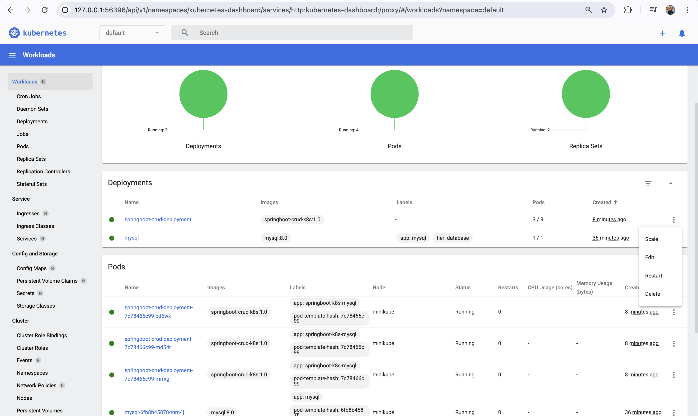

# Spring Boot CRUD Application with MySQL on Kubernetes

This guide outlines the steps to deploy a Spring Boot CRUD application on Kubernetes using MySQL.

## Prerequisites
- **Docker** installed and running
- **Minikube** installed
- **Kubernetes CLI (`kubectl`)** installed
- **Maven** installed

---

## **1️⃣ Setting Up MySQL Database**

### **Step 1: Start Minikube**
```sh
minikube start
```
#### **Sample Output:**
```
😄  minikube v1.35.0 on Darwin 15.3.1 (arm64)
✨  Automatically selected the docker driver
🏄  Done! kubectl is now configured to use "minikube" cluster and "default" namespace by default
```

### **Step 2: Deploy MySQL to Kubernetes**
```sh
kubectl apply -f db-deployment.yaml
```
#### **Sample Output:**
```
persistentvolumeclaim/mysql-pv-claim created
deployment.apps/mysql created
service/mysql created
```

### **Step 3: Verify MySQL Pod Status**
```sh
kubectl get pods
```
#### **Sample Output:**
```
NAME                     READY   STATUS    RESTARTS   AGE
mysql-6fb8b45878-tnm4j   1/1     Running   0          110s
```

### **Step 4: Access MySQL Pod**
```sh
kubectl exec -it <mysql-pod-name> -- /bin/bash
```
Inside the container:
```sh
mysql -h mysql -u root -p
```
(Enter password: `root`)

### **Step 5: Verify MySQL Databases**
```sql
show databases;
```
#### **Sample Output:**
```
+--------------------+
| Database           |
+--------------------+
| information_schema |
| kubernetes         |
| mysql              |
| performance_schema |
| sys                |
+--------------------+
```

---

## **2️⃣ Deploying Spring Boot CRUD Application**

### **Step 1: Build the Application JAR**
```sh
mvn clean package -DskipTests
```
#### **Sample Output:**
```
[INFO] Building jar: target/app.jar
[INFO] BUILD SUCCESS
```

### **Step 2: Build the Docker Image**
```sh
docker build -t springboot-crud-k8s:1.0 .
```
#### **Sample Output:**
```
Successfully built springboot-crud-k8s:1.0
```

### **Step 3: Deploy Application to Kubernetes**
```sh
kubectl apply -f app-deployment.yaml
```
#### **Sample Output:**
```
deployment.apps/springboot-crud-deployment created
service/springboot-crud-svc created
```

### **Step 4: Verify Application Deployment**
```sh
kubectl get deployment
```
#### **Sample Output:**
```
NAME                         READY   UP-TO-DATE   AVAILABLE   AGE
springboot-crud-deployment   3/3     3            3           21s
```

### **Step 5: Check Running Pods**
```sh
kubectl get pods
```
#### **Sample Output:**
```
NAME                                          READY   STATUS    RESTARTS   AGE
springboot-crud-deployment-7c78466c99-cd5wx   1/1     Running   0          32s
springboot-crud-deployment-7c78466c99-md54r   1/1     Running   0          32s
springboot-crud-deployment-7c78466c99-mrrxg   1/1     Running   0          32s
```

### **Step 6: Check Application Logs**
```sh
kubectl logs <springboot-pod-name>
```

### **Step 7: Get the Service URL**
```sh
minikube service springboot-crud-svc --url
```
#### **Sample Output:**
```
http://127.0.0.1:56322
```

### **Step 8: Open Kubernetes Dashboard**
```sh
minikube dashboard
```
#### Sample Output:

---

Now, the Spring Boot CRUD application is **running on Kubernetes** and is connected to MySQL. 🎉